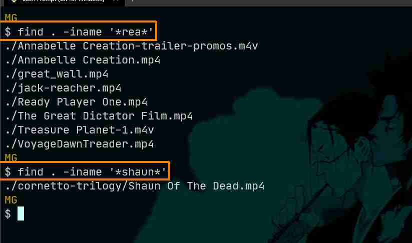

- list only directories  
`ls -d */`

- list all directories under one directory  
`ls -d MG/*/`

- list all items under one folder recursively  
`ls cornetto-trilogy/*`

- find all files that have a filename containing the string **"rea"**  
`find . -iname '*rea*'`  
notes:  
    - the dot (`.`) means current folder
    - `-iname` makes the search case insensitive  
    - this instruction will work recursively

